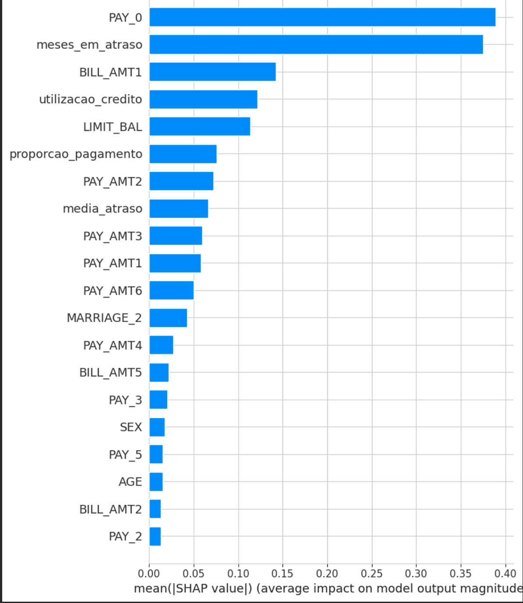
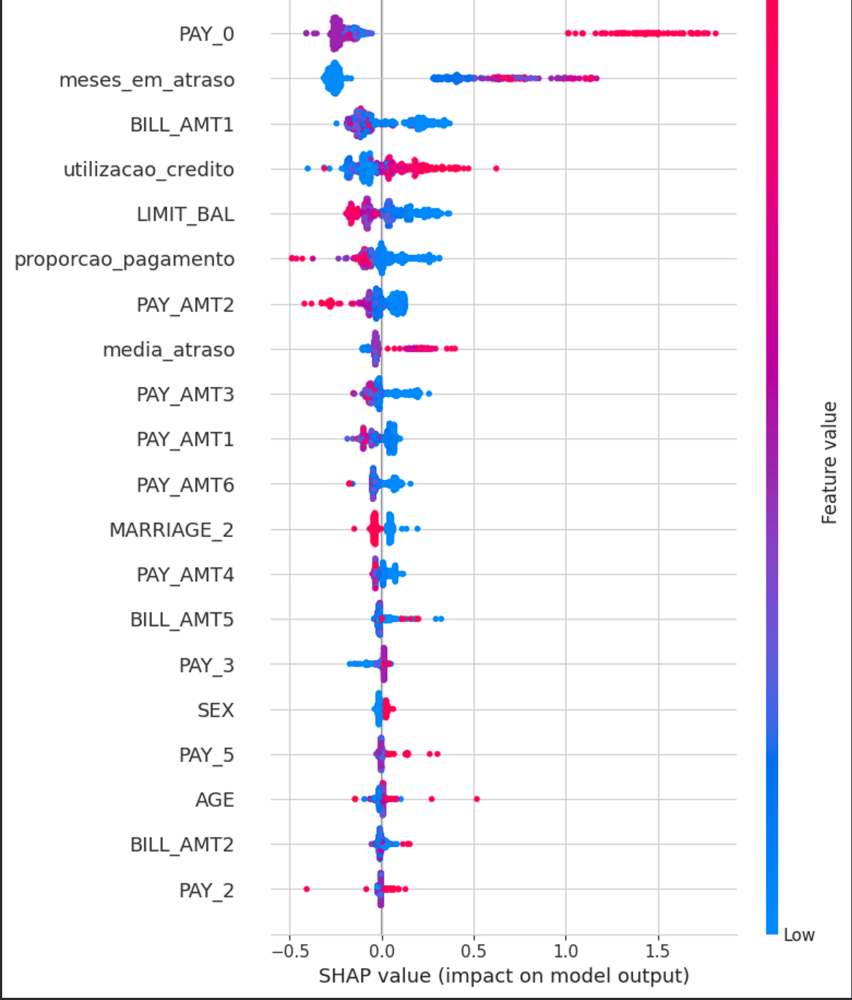
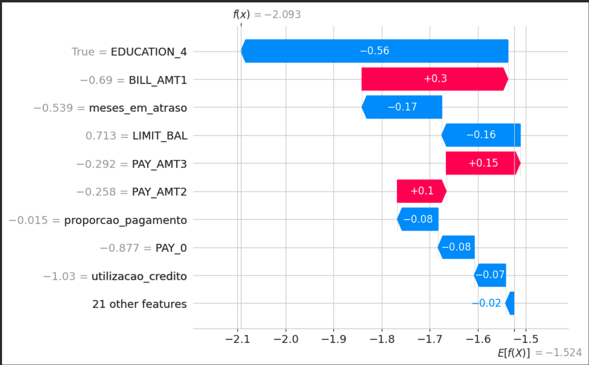

# Credit Early Warning

[Português](README.md) | English

Early warning model for credit card default. End-to-end machine learning pipeline to predict whether a credit card client will default on the next month's payment. Built as the final project for the Machine Learning Engineering course of the postgraduate program in AI Engineering at UniCEUB (Brasília, Brazil).

> The notebook is written in Portuguese. Code, outputs and charts are readable regardless of language.

**[Open the notebook in Google Colab](https://colab.research.google.com/drive/1-i_1RuEuG3neY7lfPizUtB9SF5eduMdq?usp=sharing)**

## Problem

Binary classification: given a client's profile and last 6 months of payment history, predict default in the following month (1 = default, 0 = paid).

Minimum targets set by the course:

| Metric | Target |
|---|---|
| AUC-ROC | ≥ 0.75 |
| Recall | ≥ 0.60 |
| F1-Score | ≥ 0.65 |

## Dataset

[Default of Credit Card Clients](https://archive.ics.uci.edu/dataset/350/default+of+credit+card+clients), UCI Machine Learning Repository (id=350), licensed under CC BY 4.0.

- 30,000 clients, 23 features
- Imbalanced target: 77.9% paid, 22.1% default
- Loaded directly with `ucimlrepo`, no local files or authentication needed

## Pipeline

1. **Data loading** with `ucimlrepo` and renaming of the generic columns (`X1`...`X23`) using the dataset's own metadata
2. **EDA**: distributions, correlations, default rate by group, outliers
3. **Cleaning**: undocumented category codes in `EDUCATION` (0, 5, 6) and `MARRIAGE` (0) grouped into the existing "other" category
4. **Feature engineering**: 4 derived features
   - `utilizacao_credito`: latest bill / credit limit
   - `media_atraso`: mean of the 6 payment status codes
   - `meses_em_atraso`: number of months with late payment
   - `proporcao_pagamento`: total paid / total billed
5. **Split**: stratified 70/15/15 (train/validation/test), `StandardScaler` fit on train only
6. **Modeling**: Logistic Regression, Decision Tree, Random Forest, SVM, then Gradient Boosting, SMOTE and XGBoost
7. **Tuning**: `RandomizedSearchCV` optimizing F1, plus decision threshold search (maximize F1 with Recall ≥ 0.60)
8. **Explainability** with SHAP (TreeExplainer)
9. **Demo** on synthetic clients generated with `faker`
10. **Monitoring proposal** with a PSI (Population Stability Index) function for drift detection

## Results (validation set)

Baseline models, default hyperparameters:

| Model | AUC-ROC | F1 | Recall | Precision |
|---|---|---|---|---|
| Random Forest | 0.758 | 0.463 | 0.363 | 0.639 |
| Logistic Regression | 0.748 | 0.397 | 0.282 | 0.666 |
| SVM | 0.724 | 0.444 | 0.337 | 0.652 |
| Decision Tree | 0.591 | 0.364 | 0.369 | 0.359 |

Progression of the techniques tested:

| Step | AUC-ROC | F1 | Recall |
|---|---|---|---|
| Random Forest baseline | 0.758 | 0.463 | 0.363 |
| + `class_weight="balanced"` | 0.755 | 0.432 | 0.327 |
| + hyperparameter tuning | 0.778 | 0.539 | 0.579 |
| + threshold adjustment | 0.778 | 0.535 | 0.606 |
| **Gradient Boosting + threshold (final)** | **0.782** | **0.543** | **0.619** |
| Gradient Boosting + SMOTE + threshold | 0.772 | 0.530 | 0.603 |
| XGBoost + threshold | 0.756 | 0.507 | 0.610 |

**Final model:** Gradient Boosting with the derived features, decision threshold at 0.2325.
AUC-ROC and Recall met the targets. F1 (0.543) stayed below 0.65.

### Why F1 didn't reach the target

To get F1 = 0.65 with Recall = 0.60, Precision would need to be around 0.71. The final model reached 0.484. Class balancing, tuning, extra features, boosting, SMOTE and XGBoost all landed F1 in the 0.50 to 0.54 range, which points to class overlap in the available features rather than a modeling choice that could be fixed with more tuning.

## Explainability (SHAP)

`PAY_0` (most recent payment status) is the strongest predictor. Two of the engineered features ranked 2nd (`meses_em_atraso`) and 4th (`utilizacao_credito`). Higher credit limits push predictions toward lower risk.

<p align="center">
  
  
</p>

Individual prediction breakdown:

<p align="center">
  
</p>

## Monitoring proposal

- Track AUC-ROC, F1 and Recall as true labels become available
- Detect drift with PSI on key features (`PAY_0`, `meses_em_atraso`, `utilizacao_credito`)
- Retrain when PSI > 0.25, AUC-ROC drops more than 0.05 from validation, or quarterly
- Version model and training data, log every prediction with timestamp

## Limitations and next steps

- All reported metrics come from the validation set, which was also used to pick the model and the threshold, so they are likely a bit optimistic. The test set was split and scaled but not used for a final evaluation. Next step: evaluate the final model once on `X_test`.
- F1 target not met (see above). Possible directions: cost-sensitive learning, stacking, or external data such as credit bureau history.
- The synthetic demo samples each feature independently and uniformly, so the generated clients don't follow the joint distribution of the real data.

## How to run

**Colab (recommended):** open the link at the top and run all cells. Everything installs and downloads automatically.

**Local:**

```bash
git clone https://github.com/lramosc1512/credit-early-warning.git
cd credit-early-warning
pip install -r requirements.txt
jupyter notebook previsao_inadimplencia_cartao_credito.ipynb
```

The `RandomizedSearchCV` cell can take 5 to 15 minutes depending on the machine.

## Tech stack

Python, pandas, NumPy, scikit-learn, XGBoost, imbalanced-learn, SHAP, Matplotlib, seaborn, Faker, ucimlrepo

## Author

Leonardo Ramos Coutinho
[LinkedIn](https://www.linkedin.com/in/leonardorcoutinho)
